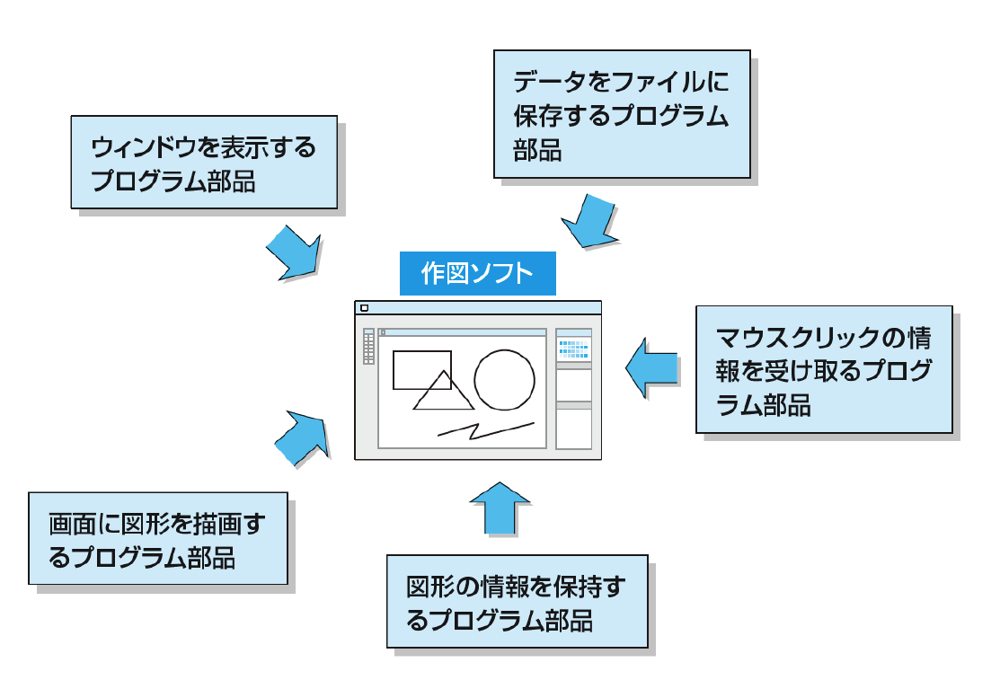
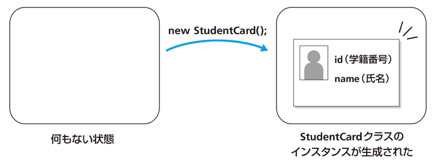
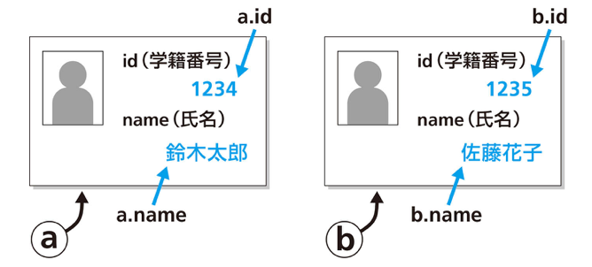
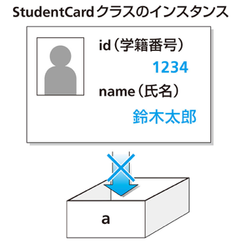
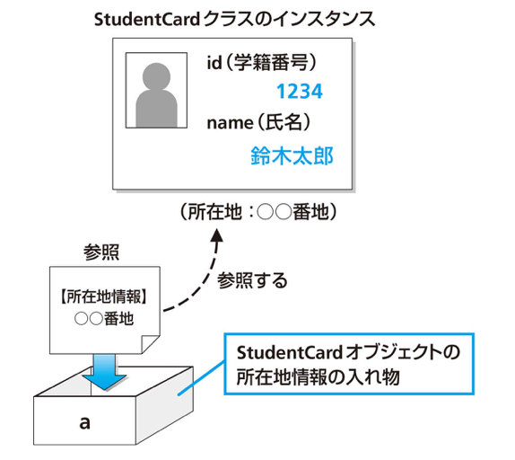
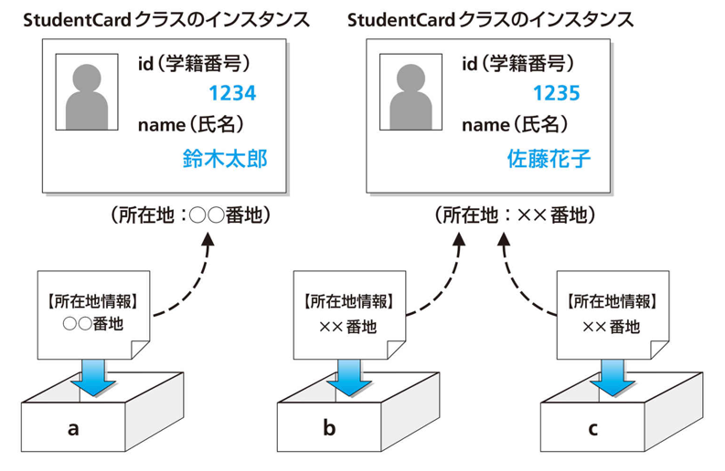
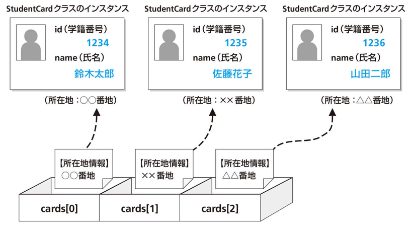
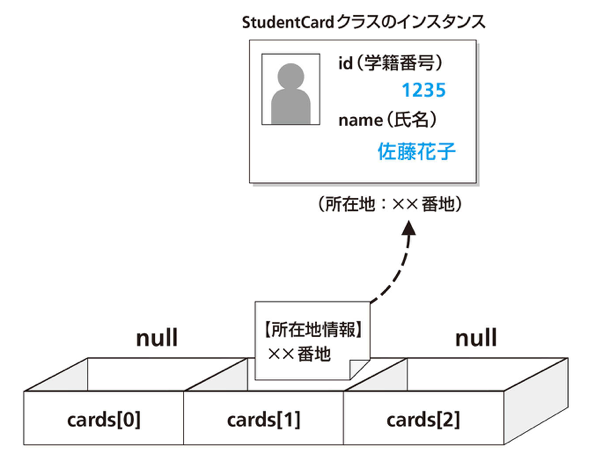
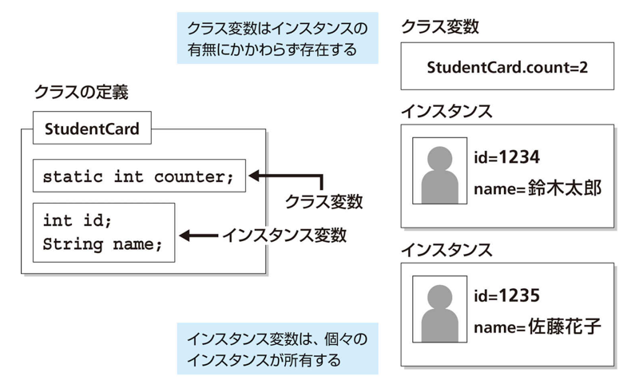

# プログラミング実習
# 第7回授業資料
**クラス**

講義担当：清水 哲也(shimizu@info.shonan-it.ac.jp)

---

# 今回の授業内容

- [前回の課題の解答例](#前回の課題の解答例)
- [クラスとインスタンス](#クラスとインスタンス)
- [参照](#参照)
- [コンストラクタ](#コンストラクタ)
- [クラス変数とクラスメソッド](#クラス変数とクラスメソッド)
- [課題](#課題)

---

<div Align=center>

# 前回の課題の解答例

</div>

---

# 前回の課題の解答例

SAの学生さんによる解答例です．
https://shimizu-lab.notion.site/ppt-6th-practice-sample-answers

---

<div Align=center>

# クラスとインスタンス

</div>


---

# オブジェクト指向とは

- プログラム部品を組み合わせることでプログラム全体を作成する
- プログラムを自動車に例えると・・・
  - 自動車は様々な部品から構成される
    - 車体・エンジン・タイヤ，ヘッドライト etc
  - 最終製品は部品の組み合わせ
  - それぞれの部品の内部構造を知らなくても，組み合わせ方（使い方）がわかればよい
  - 部品単位でアップデートできる

---

# オブジェクト指向とクラス

- 「**プログラムの部品＝オブジェクト**」と考える
- オブジェクトがどのようなものか記述したものが「**クラス(class)**」
- Javaによるプログラミング ＝ **classを定義すること**
- 複雑なプログラムは多くのプログラム部品から構成される

<div Align=center>



</div>

---

# クラスとインスタンス

- **クラス**
  - オブジェクトに共通する属性（情報・機能）を抽象化したもの
- **インスタンス**
  - 具体的な個々のオブジェクト

<div style="font-size: 0.8em">

|     アプリの例     |           クラス           |         インスタンス          |
| ------------------ | -------------------------- | ----------------------------- |
| 学生情報管理ツール | 管理項目を定めたもの       | 学生Aの情報，学生Bの情報，etc |
| RPGゲーム          | 敵の情報や動作を定めたもの | モンスターA，モンスターB，etc |
| サッカーゲーム     | 選手が持つ情報を定めるもの | 選手1，選手2，etc             |

</div>

---

# 簡単なクラスの宣言とインスタンスの生成

例として学籍番号(`id`)と氏名(`name`)を持つ学生書を扱うためのクラスは，次のように宣言できます

```java
class StudentCard {
  int id;
  String name;
}
```

- クラスの名前は自由に決められる（今回は`StudentCard`とします）
- `id`と`name`という名前のint型とString型の変数をクラスの中に定義しました（**フィールド**と呼びます）
- `id`と`name`という2つの値をセットにして扱えます
---

# インスタンスの生成

インスタンスを生成するには`new`を使用します

```java
new StudentCard();
```




---

# インスタンスの生成

生成したインスタンスを変数`a`に代入できます（`a`でなくてもOKです）

```java
StudentCard a = new StudentCard();
```

インスタンスが持つ変数に値を代入できます

```java
StudentCard a = new StudentCard();

a.id = 1234;
a.name = "鈴木太郎";
```

---

# インスタンス変数へのアクセス

- インスタンスが持つ変数（クラスのフィールドに定義された変数）のことを「**インスタンス変数**」と呼びます
- `StudentCard`クラスでは変数`id`と`name`が**インスタンス変数**
- インスタンス変数にアクセスするには「**インスタンスを代入した変数名＋ドット＋インスタンス変数名**」とします

**インスタンス変数へのアクセス例**

```java
StudentCard a = new StudentCard();
a.id = 10;
System.out.println("aのidは" + a.id);
```
（ドットを「の」に置き換えて「aのx」と読むとわかりやすいです）

---

# StudentCardクラスの使用例



---

<!-- _class: no-footer -->

# StudentCardクラスの使用例

```java
class StudentCard {
  int id; // 学籍番号
  String name; // 氏名 
}

public class App {
  public static void main(String[] args) throws Exception {
    StudentCard a = new StudentCard();
    a.id = 1234;
    a.name = "鈴木太郎";
    StudentCard b = new StudentCard();
    b.id = 1235;
    b.name = "佐藤花子";

    System.out.println("aのidは" + a.id);
    System.out.println("aのnameは" + a.name);
    System.out.println("bのidは" + b.id);
    System.out.println("bのnameは" + b.name);
  }
}
```

---

<div Align=center>

# 参照

</dvi>

---

# 参照型

- Javaで使用できる変数の型
  - 基本型（`int`, `double`, `boolean`など）
  - 参照型（**インスタンスへの参照**）
- 変数にインスタンスそのものは代入できない



---

<!-- _class: no-footer -->

# 参照の代入

```java
StudentCard a = new StudentCard();
```
としたとき，変数`a`には`StudentCard`クラスのインスタンスの参照が代入されます



---

# 参照の例



---

# 参照の例


```java
StudentCard a = new StudentCard();
StudentCard b = new StudentCard();
StudentCard c = b;
a.id = 1234;
a.name = "鈴木太郎";
b.id = 1235;
b.naem = "佐藤花子";
```

この例では，`StudentCard c = b;`としているので`b.id = 1235;`と`b.name = "佐藤花子"`で変数`b`と`c`に同じ値が入ることになります．逆に`c.id`と`c.name`に適当な値を入れると変数`b`も`c`と同じになります．

---

# 参照の配列

基本型の配列と同じように，参照の配列も作成できます

```java
StudentCard[] cards = new StudentCard[3];
cards[0] = new StudentCart();
cards[1] = new StudentCart();
cards[2] = new StudentCart();
cards[0].id = 1234;
cards[0].name = "鈴木太郎";
cards[1].id = 1235;
cards[1].name = "佐藤花子";
cards[2].id = 1236;
cards[2].name =  "山田二郎";
```

---

# 参照の配列



---

<!-- _class: no-footer -->

# 何も参照しないことを表す`null`

参照型の変数に，何も参照が入っていない状態はを`null`といいます

```java
StudentCard[] cards = new StudentCard[3];
cards[1] = new StudentCard();
cards[1].id = 1235;
catds[1].name = "佐藤花子";
```



---

# `null`は参照型の値

`null`は，参照型の変数に代入できます

```java
StudentCard a;
a = null;
```

`null`は参照型の変数の値と比較できます

```java
StudentCard a = new StudentCard();
if (a == null) {
  System.out.println("aはnull");
} else {
  System.out.println("aはnullでない")'
}
```

---

# 参照とメソッド

メソッドには引数としてインスタンスの参照を受け渡しができます

```java
static void reset(StudentCart card) {
  card.id = 0;
  card.name = "未定";
}
```

メソッドの戻り値にすることもできます

```java
static StudentCard compare(StudentCard card0, StudentCard cart1) {
  if (card0.id < card1.id) {
    return card0;
  } esle {
    return card1;
  }
}
```

---

<!-- _class: no-footer -->

# クラスの定義とファイル

複数のクラス宣言を1つのファイルに記述せず，複数のファイルに分けて記述できます

`StudentCard.java`

```java
public class StudentCard {
  （中略）
}
```

`App.java`
```java
public class App{
  public void main(String args) {
    // StudentCardクラスを使った処理を行う
    （中略）
  }
}
```

---

# インスタンス変数の初期値

インスタンス変数は，インスタンスが生成されるときに自動的に初期化されます

```java
class DataSet {
  int i;          // 0で初期化されます
  double d;       // 0.0で初期化されます
  boolean b;      // falseで初期化されます
  String s;       // nullで初期化されます
  DataSet data;   // nullで初期化されます
}
```

---

<div Align=center>

# コンストラクタ

</div>

---

# コンストラクタ

コンストラクタとは，インスタンスが生成されるときに自動的に実行される特別なメソッド

## コンストラクタの構文
```java
クラス名(引数列) {
  命令文
}
```

- クラス名と同じ名前のメソッド
- 引数を渡せます（初期化に使用できます）
- 戻り値を定義できないです

---

<!-- _class: no-footer -->

# コンストラクタの例

コンストラクタをもつ`StudentCard`クラス

<div style="font-size: 0.8em">

```java
class StudentCard {
  int id;
  String name;

  // コンストラクタ
  StudentCard(int id, String name) {
    this.id = id;
    this.name = name;
  }
}
```

</div>

インスタンスの生成

<div style="font-size: 0.8em">

```java
StudentCard a = new StudentCard(1234, "鈴木太郎");
System.out.println(a.id);
System.out.println(a.name);
```

</div>

---

# 自分自身を表す`this`

インスタンス変数を参照する

```java
this.変数名
```

自分のメソッドを実行する

```java
this.メソッド名(引数)
```

自分のコンストラクタを実行する

```java
this(引数)
```

**※この記述が行えるのはコンストラクタの先頭行だけです**

---

# コンストラクタのオーバーロードの例

```java
class StudentCard {
  int id;
  String name;
  StudentCard() {
    this.id = 0;
    this.name = "未定";
  }
  StudentCard(String name) {
    this.id = 0;
    this.name = name;
  }
  StrudentCard(int id, String name) {
    this.id = id;
    this.name = name;
  }
}
```

---

# コンストラクタのオーバーロードの例

インスタンスの生成

```java
StudentCard a = new StudentCard();
StudentCard b = new StudentCart("鈴木太郎");
StudentCard c = new StudentCard(1235, "佐藤花子");
```

---

# `this`の省略

参照しているものが自分自身（インスタンス）の変数またはメソッドであることが明らかな場合，`this`を省略できます

### 省略できない場合

```java
StudentCard(int id, String name) {
  this.id = id;
  this.name = name;
}
```

このプログラムで`this`を省略すると`id = id`となり，**引数**と**インスタンス変数**の区別がつかなくなるのでこの場合は`this`を省略することができません 

---

# `this`の省略

参照しているものが自分自身（インスタンス）の変数またはメソッドであることが明らかな場合，`this`を省略できます

### 省略できる場合

```java
StudentCard(int i, String s) {
  id = i;
  name = s;
}
```

この場合は，`id = i`となり，引数とインスタンス変数の違いが明確にわかります．なので，`this`を省略することがでいます

---

<div Align=center>

# クラス変数とクラスメソッド

</div>

---

# クラス変数

- **インスタンス変数**：インスタンスごとに保存される情報
- **クラス変数**：クラスに保持される情報

### 例：「犬」クラスについて考えてみる
- **インスタンス変数**：名前，性別，毛色
- **クラス変数**：足の本数，尻尾の有無

- インスタンス変数は個別のオブジェクトの属性を表します
- クラス変数はクラスとして持っている属性を表します

---

# クラス変数の例

- クラス変数を宣言するときには，`static`修飾子をつけます
- クラス変数は宣言の時に初期化しておきます

`StudentCard`クラスに，`counter`という`int`型のクラス変数を追加した例

```java
class StudentCard {
  static int counter;
  int id;
  String name;
} 
```

---

# クラス変数とインスタンス変数



---

# クラス変数の利用例
コンストラクタが呼び出されるたびに`counter`をカウントアップする

```java
public class StudentCard {
  static int counter = 0;
  int id;
  String name;

  StudentCard(int id, String name) {
    System.out.println("コンストラクタが呼び出されました");
    this.id = id;
    this.name = name;
    StudentCard.counter++;
  }
}
```

---

# クラス変数の利用例

```java
public static void main(String[] args) {
  System.out.println("StudentCard.counter=" + StudentCard.counter);

  StudentCard a = new StudentCard(1234, "鈴木太郎");
  System.out.println("StudentCard.counter=" + StudentCard.counter);

  StudentCard a = new StudentCard(1235, "佐藤花子　");
  System.out.println("StudentCard.counter=" + StudentCard.counter);
}
```

- クラス変数には「`クラス名.クラス変数名`」でアクセスできます
- クラス変数は，インスタンスを1つも生成しなくても参照できます

---

<!-- _class: no-footer -->

# クラス名の省略

**インスタンス変数**を参照することが明らかな場合は`this`を省略できました．同様に，**クラス変数**を参照することが明らかな場合も，クラス名を省略できます

```java
public class StudentCard {
  static int counter = 0;
  int id;
  String name;

  StudentCard(int id, String name) {
    System.out.println("コンストラクタが呼び出されました");
    this.id = id;
    this.name = name;
    //StudentCard.counter++;
    counter++;
  }
}
```

---

# クラスメソッド

- クラスに対して呼び出される「**クラスメソッド**」というメソッドがあります
- インスタンスを生成しなくても「`クラス名.メソッド名`」で呼び出すことができます
- メソッドの宣言に`static`修飾子をつけます

---

# クラスメソッドの例

```java
class SimpleCale {
  // 引数で渡された底辺と高さの値から三角形の面積を返します
  static double getTriangleArea(double base, double height) {
    return base * height / 2.0;
  }
}
```

クラスメソッドの使用例

```java
System.out.println("底辺が10，高さが5の三角形の面積は" + SimpleCalc.getTriangleArea(10,5) + "です");
```

インスタンスを生成しなくても使用できます
単純な計算処理のように，インスタンス変数を使用しない処理を行うのに便利です

---

# クラスの構造の復習

```java
class クラス名 {
  インスタンス変数の宣言;
  インスタンス変数の宣言;
  ・・・
  クラス変数の宣言;
  クラス変数の宣言;
  ・・・
  コンストラクタの宣言;
  コンストラクタの宣言;
  ・・・
  インスタンスメソッドの宣言;
  インスタンスメソッドの宣言;
  ・・・
  クラスメソッドの宣言;
  クラスメソッドの宣言;
}
```

---

<div Align=center>

# 課題

</dvi>

---

# 課題

- 課題はMoodle上にあります
- 課題に書かれている問題に解答するプログラムを作成してください
- 作成したプログラムを実行して問題なく動作しているかを確認してください
- 動作確認が終わったら，プログラムファイル（`filename.java`）をMoodleに提出してください

### 提出期限は **11月10日(月) 21:00** まで
