# プログラミング実習
# 第8回授業資料
**簡単なアルゴリズム**

講義担当：清水 哲也(shimizu@info.shonan-it.ac.jp)

---

# 今回の授業内容

- [前回の課題の解答例](#前回の課題の解答例)
- [素数判定法](#素数判定法)
- [ユークリッドの互除法](#ユークリッドの互除法)
- [場合の数とアルゴリズム](#場合の数とアルゴリズム)
- [課題](#課題)

今回の授業内容は以下の本の内容を抜粋しました

[問題解決のための「アルゴリズム×数学」が基礎からしっかり身につく本](https://gihyo.jp/book/2022/978-4-297-12521-9)

---

<div Align=center>

# 前回の課題の解答例

</div>

---

# 前回の課題の解答例

SAの学生さんによる解答例です．
https://shimizu-lab.notion.site/ppt-7th-practice-sample-answers

---

<div Align=center>

# 素数判定法

</div>

---

# 素数判定法

自然数 $N$ が素数であるかどうかを判定する問題を扱います
素数判定法はいろんなアルゴリズムがありますがここでは以下の２つを紹介します

- 単純な素数判定法
- 高速な素数判定法

---

# 単純な素数判定法

例：「$53$」が素数であるかを判定してみましょう

- とても単純な方法を考えると $2$ から $52$ まで割り切れるかどうかを調べる方法があります
- デメリットは計算に時間がかかることです
- 一般の正整数 $N$ の場合ても同じように $2$ から $N-1$ まで割り切れるかどうかを調べることで素数判定を行うことができます
- このアルゴリズムの計算量は $O(N)$ になりかなり時間がかかります

---

# 単純な素数判定法

 例：$53$ が素数であるかを判定してみましょう

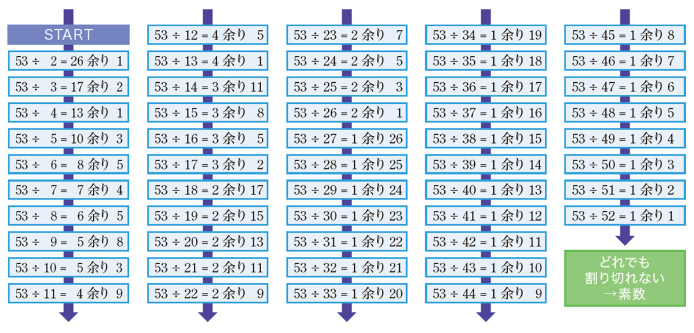

---

# 単純な素数判定法

```java
static boolean isPrime(int N) {
  // N を 2以上の整数とし，Nが素数であれば true，素数でなければ false を返す
  for (int i = 2; i <= N - 1; i++) {
    if (N % i == 0) {
      return false;
    }
  }
  return true;
}
```

このプログラムは `int`の範囲であれば実行できます
`int` の範囲は `-2,147,483,648` 〜 `2,147,483,647` なので，例えば「`2147483647`」の素数判定をしてみましょう
この程度の数であればほぼタイムラグなく実行できます

---

# javaで扱える整数型

javaで扱える整数型は以下の4種類があります

<div style="font-size: 0.8em">

| データ型 | ビット数 |                        値                         |
| -------- | -------- | ------------------------------------------------- |
| `byte`   | 8 bit    | -128 - 127 (3桁)                                  |
| `short`  | 16 bit   | -32768 - 32767 (5桁)                              |
| `int`    | 32 bit   | -2147483648 - 2147483647 (10桁)                   |
| `long`   | 64 bit   | -9223372036854775808 - 9223372036854775807 (19桁) |

</div>

より大きい整数を扱うためにはデータ型を `int` から `long` に変更する必要があります
試しに「999999999989」（12桁）の素数判定を後でやってみてください
すぐに終わらないので注意！！(私の環境では約8分かかりました)

---

# 高速な素数判定法

単純な素数判定法は $2$ から $N-1$ まで全部を調べているため $N$ が大きくなるとその分計算に時間がかかってしまう
実は $2$ から $N-1$ まで全部を調べる必要はなく $2$ から $\sqrt{N}$ まで調べて割り切れなければ $N$ は素数だと言えます
これが正しいことを示すのは省略します

---

# 高速な素数判定法

例1「53の場合」： $\sqrt{53} = 7.28 \cdots$ なので$2, 3, 4, 5, 6, 7$ までで割り切れなければ「**$53$ は素数**」といえます

例2「77の場合」： $\sqrt{77} = 8.77 \cdots$ なので$2, 3, 4, 5, 6, 7, 8$ まで調べますが，$7$ で割り切れるので「**$77$は合成数**」といえます

<div Align=center>

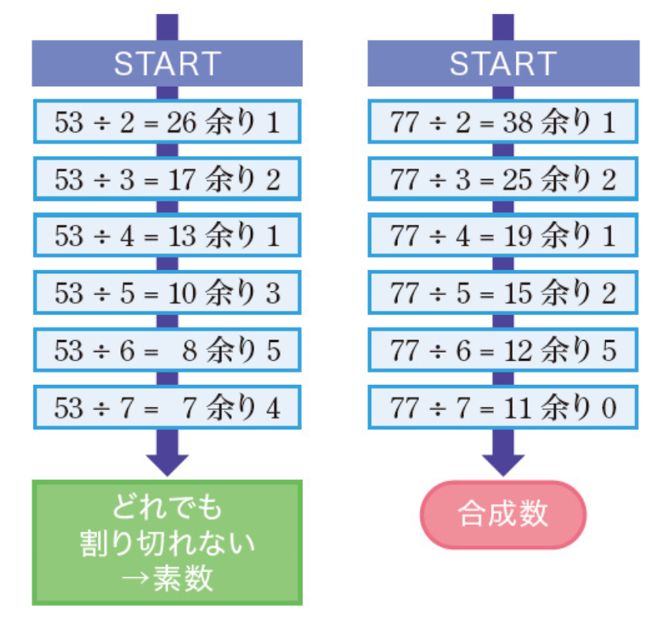

</div>

---

<!-- _class: no-footer -->

# 高速な素数判定法

このアルゴリズムの計算量は $O(\sqrt{N})$ となり，$O(N)$ 比較したグラフを示します

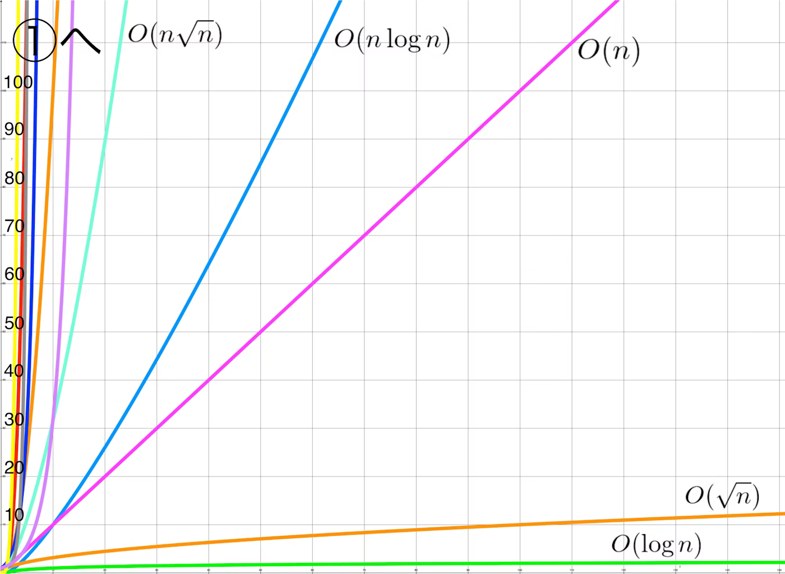

https://qiita.com/kokorinosoba/items/1c7400ca6c740fe9f1ee

---

# 高速な素数判定法

この方法をプログラムにしてみましょう

```java
static boolean isPrime(long N) {
    // N を 2以上の整数とし，Nが素数であれば true，素数でなければ false を返す
    for( long i = 2; i * i <= N; i++) {
        if(N % i == 0) return false;
    }
    return true;
}
```

このプログラムであれば，「999999999989」の素数判定法も計算時間がわずか数ms程度になるとおもいます．(私の環境では6msかかりました)

---

<div Align=center>

# ユークリッドの互除法

</div>

---

# ユークリッドの互除法

自然数 $A$ と $B$ の最大公約数を求める問題を扱います
素数判定法と同様に2種類のアルゴリズムを実装してみます

- 単純なアルゴリズム
- 効率的なアルゴリズム：ユークリッドの互除法

ユークリッドの互除法を利用すると計算量は $O(\log(A+B))$ となります


---

<!-- _class: no-footer -->

# 単純なアルゴリズム

$33$ と $88$ の最大公約数を計算してみましょう
ここで明らかなことは，答えが $33$ 以下になることです
この条件を利用して単純なアルゴリズムは $1$ から $33$ までの数を使って，$33$ と $88$ 両方が割り切れるかどうかを調べる方法とします

<div Align=center>

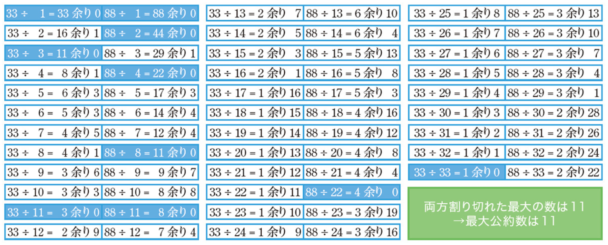

</div>

---

<!-- _class: no-footer -->

# 単純なアルゴリズム

```java
  // 正の整数AとBの最大公約数を返すメソッド
  static long GCD(long A, long B) {
    long Answer = 0;

    for (long i = 1; i <= Math.min(A, B); i++) {
      if (A % i == 0 && B % i == 0) {
        Answer = i;
      }
    }
    return Answer;
  }
```

ここで `Math.min(A,B)` は$A$ と $B$ のうち小さい値を返すメソッドです
このプログラムでは余りの計算を$2 \times \min(A, B)$ 回行う必要があり，あまり効率的ではありません
`100000000000`と`123450000000`で試してみてください

---

# 効率的なアルゴリズム：ユークリッドの互除法

以下の方法を利用すると2つの正整数の最大公約数を高速に計算することができます

> 1. 大きいほうの数を「大きいほうを小さいほうで割った余り」に書き換えるという操作を繰り返す
> 2. 片方が0になったら操作を終了する．もう片方の数が最大公約数である

---

<!-- _class: no-footer -->

# 効率的なアルゴリズム：ユークリッドの互除法

この方法で $33$ と $88$ の最大公約数， $123$ と $777$ の最大公約数をそれぞれ計算すると以下のようになります

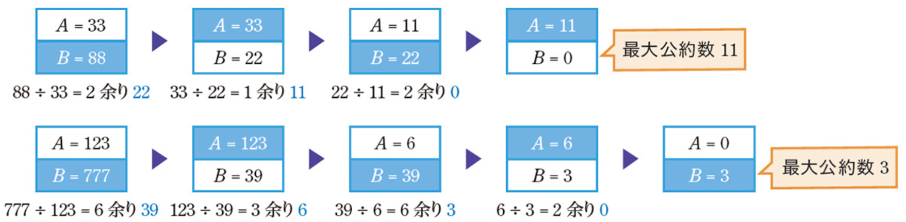

このアルゴリズムを **ユークリッドの互除法** といいます
$A$ と $B$ の最大公約数を求めるときの計算量は $O(\log(A + B))$ であるため，$A,B$ が $10^{18}$ 程度であってもある程度一瞬で計算できます

---

<!-- _class: no-footer -->

# ユークリッドの互除法の実装

```java
static long EuclideanGCD(long A, long B) {
  while (A >= 1 && B >= 1) {
    if (A < B) {
      B = B % A; // A < B の場合，大きい方Bを書き換える
    } else {
      A = A % B; // A >= Bの場合，大きい方Aを書き換える
    }
  }
  if (A >= 1) {
    return A;
  }
  return B;
}
```

このプログラムで $A$ と $B$ の大小関係によって行うべき操作が変わるので，`if`文を用いて場合分けを行っています
更に効率的に実装する方法もあります

---

<div Align=center>

# 場合の数とアルゴリズム

</div>

---

# 場合の数とアルゴリズム

ここでは，階乗・二項係数・積の法則など，基本的な場合の数の公式について扱います
- 基本公式1：積の法則
- 基本公式2：積の法則の拡張
- 基本公式3：$n$個のモノを並び替える方法の数は$n!$
- 基本公式4：$n$ 個のモノから $r$ 個を並べる方法は $_n \mathrm{P}_r$
- 基本公式5：$n$ 個のモノから $r$ 個を選ぶ方法は $_n \mathrm{C}_r$
- 応用例1：買い物の方法の数
- 応用例2：同色カードの組み合わせ
- 応用例3：全探索の計算回数

---

<!-- _class: no-footer -->

# 基本公式1：積の法則

事象 $A$ の起こり方が $N$ 通り，事象 $B$ の起こり方が $M$ 通りあるとき，事象 $A,B$ の起こり方の組み合わせは全部で $NM$ 通りあります

- 明日の朝食は，おにぎり・食パン・サンドイッチのいずれかである
- 明日の起きる時間は，5:00, 6:00, 7:00, 8:00のいずれかである

朝食を事象 $A$，起床時間を事象 $B$ とすると $3 \times 4 = 12$ 通りとなり，これを**積の法則**といいます

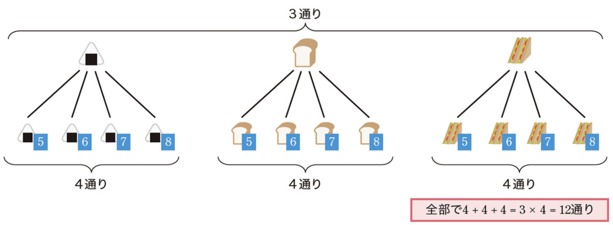

---

<!-- _class: no-footer -->

# 基本公式2：積の法則の拡張

**積の法則**は事象が3以上の場合にも拡張することができます

- **形**：円形，四角形，三角形のいずれか
- **色**：赤・青のいずれか
- **記入する数字**：1,2,3,4のいずれか

この場合も組み合わせの数は積の法則どおり $3 \times 2 \times 4 = 16$通りあります

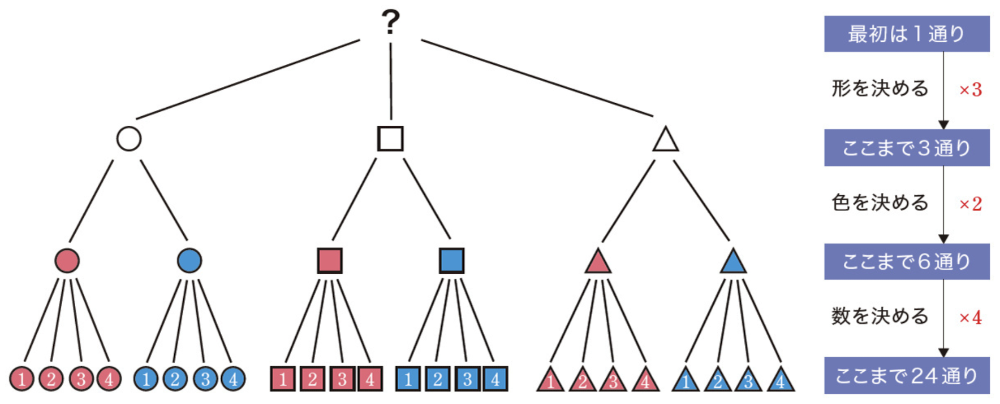

---

# 基本公式2：積の法則の拡張

選択肢が同じ数（例えば $M$ 通り）の事象が$N$ 個あるような組み合わせの数は
$$
M \times M \times M \times \cdots \times M = M^N
$$

通りあります

---

# 基本公式2：積の法則の拡張

例えば，すべての要素が $1$ または $2$ である長さ $4$ の数列 $A = (A_1, A_2, A_3, A_4)$ の個数は$2^4 = 24$通りです

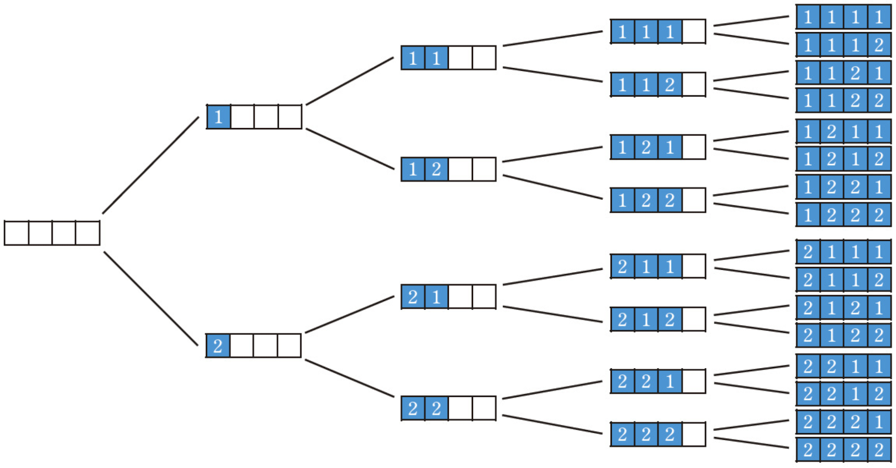

---

# 基本公式3：$n$個のモノを並び替える方法の数は$n!$

$n$  個のモノを並び替える方法は 

$$
n! = n \times (n - 1) \times (n - 2) \times \cdots \times 3 \times 2 \times 1
$$

通りあります
例えば，3つの整数$1,2,3$を並び替える方法は$3! = 3 \times 2 \times 1 = 6$通りあります

---

# 基本公式3：$n$個のモノを並び替える方法の数は$n!$

方法が $3!$ 通りになる理由は以下の樹形図をみるとわかりやすいです

<div Align=center>

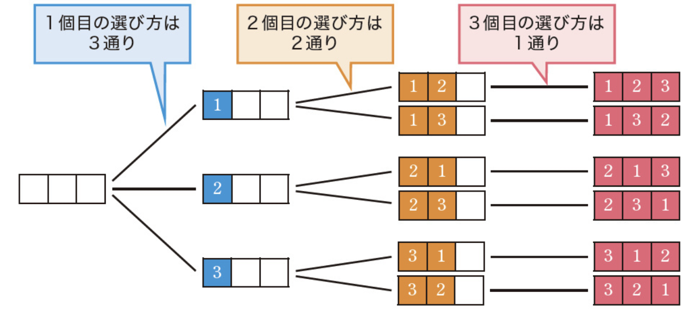

</div>

---

# 基本公式4：$n$ 個のモノから $r$ 個を並べる方法は $_n \mathrm{P}_r$

$n$ 個のモノから $r$ 個のモノを選び，これらを一列に並べる方法の数は以下の式で求めることができます

$$

_n \mathrm{P}_r = \frac{n !}{(n-r)!} = n \times (n - 1) \times (n - 2) \times \cdots \times (n - r + 1)
$$

たとえば，人 $A,B,C,D$ の中から2人を選び，並び順を決める方法は $_4 \mathrm{P}_2 = 12$ 通りあります
「1人目の選び方は $n$ 通り」「2人目の選び方は $n - 1$ 通り」と考えたうえで **積の法則** を適用させることで上式を導出することができます

---

# 基本公式4：$n$ 個のモノから $r$ 個を並べる方法は $_n \mathrm{P}_r$

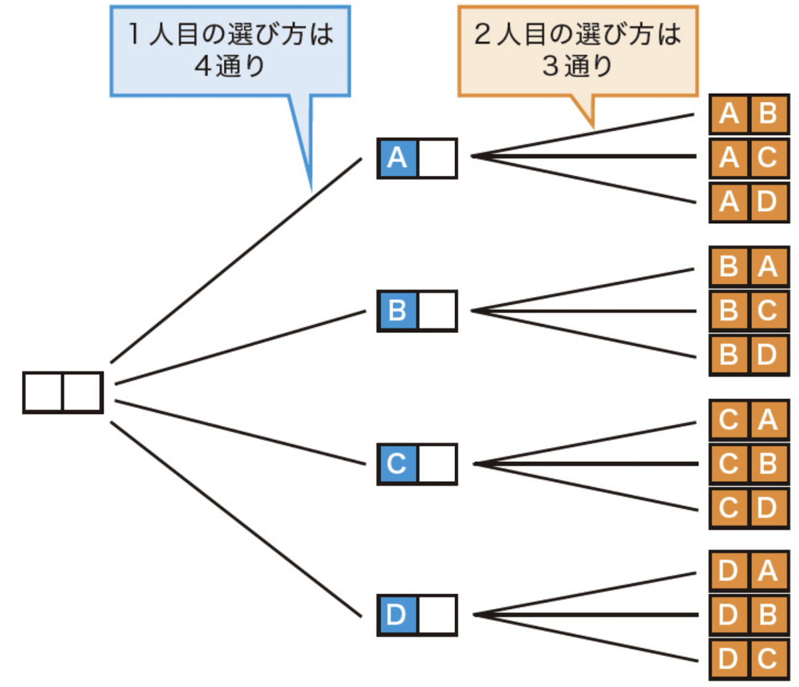


---

# 基本公式5：$n$ 個のモノから $r$ 個を選ぶ方法は $_n \mathrm{C}_r$

$n$ 個のモノから $r$ 個のモノを選ぶ方法の数は以下の式で求めることができ，これを**二項係数**といいます

$$

_n \mathrm{C}_r = \frac{n!}{r! (n-r)!} \ \ ※\ \  _n \mathrm{C}_r = 
\begin{pmatrix}
n \\
r
\end{pmatrix}

$$

この式は $_n\mathrm{P}_r$ の式と比較することで導出できます．$r$ 個のモノを並び替える方法は $r!$ 通りあるため，並び順を区別した場合のパターン数は，区別しない場合のパターン数の $r!$ 倍となります．したがって， $_n \mathrm{P}_r = r! \times {}_n \mathrm{C}_r$が成り立ちます

---

# 基本公式5：$n$ 個のモノから $r$ 個を選ぶ方法は $_n \mathrm{C}_r$

$$

_n \mathrm{C}_r = \frac{n!}{r! (n-r)!} \ \ ※\ \  _n \mathrm{C}_r = 
\begin{pmatrix}
n \\
r
\end{pmatrix}

$$

たとえば$A, B, C, D$の中から2つを選ぶ方法 $_4 \mathrm{C}_2 = 6$ 通りを示しており，並び順を区別した場合（ $_4 \mathrm{P}_2 = 12$ 通り）がその$2!=2$ 倍になっています

---

# 基本公式5：$n$ 個のモノから $r$ 個を選ぶ方法は $_n \mathrm{C}_r$

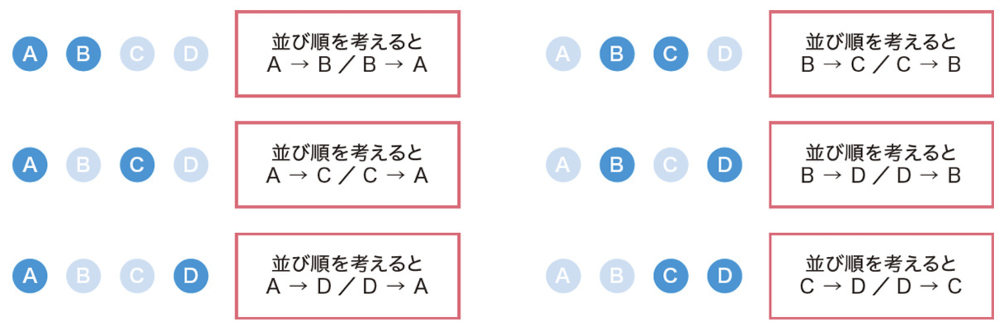

---

# 応用例1：買い物の方法の数

以下の問題を考えてみましょう

> コンビニには $N$ 個の品物が売られており，$i$ 番目（$1 \leq i \leq N$）の商品の値段は $A_i$ 円です．異なる2つの品物を買う方法のうち，合計値段が500円となるものは何通りありますか．
> **制約**： $2 \leq N \leq 200000$ ，$A_i$ は $100, 200, 300, 400$ のいずれか

商品の選び方を全探索する方法が思いつくと思います．しかし $N$ 個の中から$2$ 個の品物を選ぶため，全部で $_N \mathrm{C}_2$ 通りの選び方があります．したがって計算量は $O(N^2)$ となり，効率が悪いです．

---

<!-- _class: no-footer -->

# 応用例1：買い物の方法の数

<div style="font-size: 0.9em">

全探索ではなく別の方法を考えます
合計値段が500円となるような買い物の仕方を考えると，以下の2つしかないことが分かります

**方法A** ：100円の品物を1個, 400円の品物を1個買う
**方法B** ：200円の品物を1個, 300円の品物を1個買う

また，100円・200円・300円・400円の品物の数をそれぞれ$a, b, c, d$ 個とするとき，積の法則より，各方法における買い方の数は次の通りです．

**方法A** ：$a$ 通り$\times d$通り = $ad$ 通り
**方法B** ：$b$ 通り$\times c$通り = $bc$ 通り

したがって，求める答えは$ad + bc$となります．$a, b, c, d$ の値は計算量 $O(N)$ で数えられるので，$N = 200000$ のケースでも1秒以内に答えを出すことができます

</div>

---

# 応用例1：買い物の方法の数

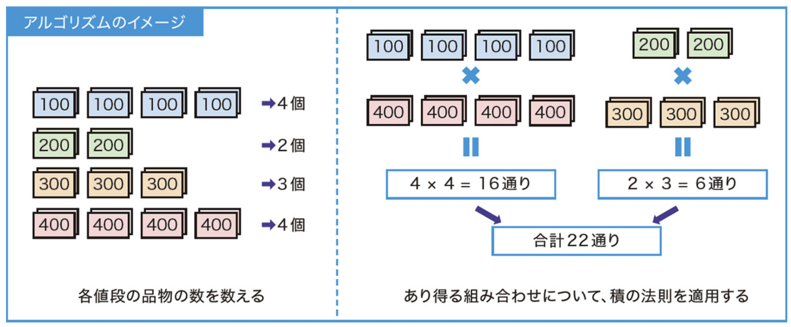

---

# 応用例2：同色カードの組み合わせ

カードの選び方の個数を求める問題です

> $N$ 枚のカードがあり，左から $i$ 番目（$1 \leq i \leq N$）のカードの色は $A_i$ です．$A_i = 1$のとき赤色，$A_i = 2$ のとき黄色，$A_i = 3$ のとき青色です．同じ色のカードを2枚選ぶ方法は何通りありますか．
> **制約**： $2 \leq N \leq 500000$, $1 \leq A_i \leq 3$

カードの選び方を全探索する方法が思いつくでしょう．しかし2枚のカードを選ぶため，全探索アルゴリズムの計算量は $O(N^2)$ となってしまい，効率が悪いです

---

<!-- _class: no-footer -->

# 応用例2：同色カードの組み合わせ

<div style="font-size: 0.9em">

全探索ではなく別の方法を考えます
赤色・黄色・青色のカードの枚数をそれぞれ $x, y, z$ 枚とするとき，以下のことが分かります．
- 赤色のカードを2枚選ぶ方法は $_x \mathrm{C}_2$ 通りある
- 黄色のカードを2枚選ぶ方法は $_y \mathrm{C}_2$ 通りある
- 青色のカードを2枚選ぶ方法は $_z \mathrm{C}_2$ 通りある
  
したがって，求める答えは以下の通りになります．

$$

_x \mathrm{C}_2 + _y \mathrm{C}_2 + _z \mathrm{C}_2 =
\frac{x(x-1)}{2} + \frac{y(y-1)}{2} + \frac{z(z-1)}{2}

$$

このように考えると，赤色・黄色・青色のカードの枚数をそれぞれ数えるだけで答えが分かります．計算量は $O(N)$ であり，全探索に比べ大幅に効率が良いです

</div>

---

# 応用例2：同色カードの組み合わせ

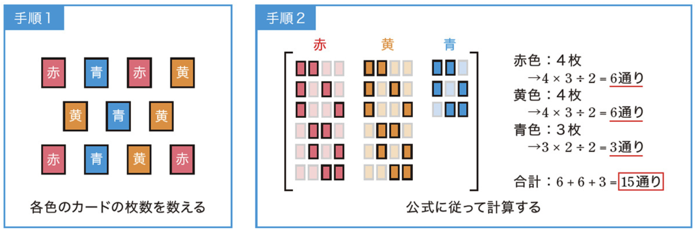

---

# 応用例3：全探索の計算回数

5枚のカードを選ぶ問題です

> $N$ 枚のカードがあり，左から$i$ 番目（$1 \leq i \leq N$）のカードには整数 $A_i$ が書かれています．カードを5枚選ぶ方法のうち，選んだカードに書かれた整数の和がちょうど $1000$ となるものは何通りありますか．
> **制約**： $5 \leq N \leq 100$, $1 \leq A_i \leq 1000$

この問題も全探索から考えていきましょう．今回は5枚のカードを選ぶため，全探索アルゴリズムの計算量は $O(N^5)$ です．単純計算をすると$100^5 = 10^{10}$ であるため，一見5秒以内に答えを出すように思えないかもしれません

---

# 応用例3：全探索の計算回数

$N$ 枚のカードから5枚を選ぶ方法は $_N \mathrm{C}_5$ 通りであるため，$N = 100$の場合でもカードの選び方は

$$
_{100} \mathrm{C}_5 = 
\frac{100 \times 99 \times 98 \times 97 \times 96}{5 \times 4 \times 3 \times 2 \times 1} =
75287520
$$

通りしかありません．これは $10^9$ を大幅に下回っており，5秒以内に実行が終わると予測できます．


---

<div Align=center>

# 課題

</dvi>

---

# 課題

- 課題はMoodle上にあります
- 課題に書かれている問題に解答するプログラムを作成してください
- 作成したプログラムを実行して問題なく動作しているかを確認してください
- 動作確認が終わったら，プログラムファイル（`filename.java`）をMoodleに提出してください

### 提出期限は **11月17日(月) 21:00** まで